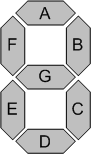
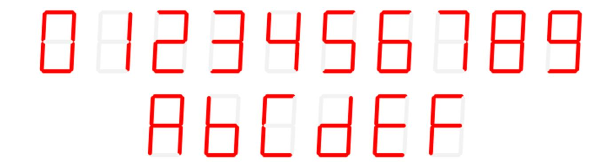
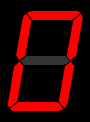

# 🔄 7-Segment Display

## 📘 Definition
A **7-Segment Display** is a digital display device used to represent decimal numbers (0–9) and hexadecimal characters (A–F).  
It consists of **seven LEDs (segments)** arranged in a figure-eight pattern, labeled **a–g**.

---

## ⚙️ Working Principle
- Each segment can be turned ON or OFF to form digits/characters.  
- Inputs: 4-bit binary data (0–F).  
- Output: 7-bit control signals for segments {a,b,c,d,e,f,g}.  
- Example: Input `4'h2` → Segments lit to display digit **2**.  

---

## 📊 Segment Layout

Segments are labeled as:  
- **a** (top)  
- **b** (top-right)  
- **c** (bottom-right)  
- **d** (bottom)  
- **e** (bottom-left)  
- **f** (top-left)  
- **g** (middle)  

---

## 🔢 Digits and Hex Characters

Top row → Digits 0–9  
Bottom row → Hex characters A–F  

---

## 🎞️ Animated Representation

This GIF shows how digits and hex characters light up on the display.

---

## 🧮 Truth Table (Hex → Segment Pattern)

| Data | Display | Segments (abcdefg) |
|------|---------|---------------------|
| 0    | 0       | 1111110             |
| 1    | 1       | 0110000             |
| 2    | 2       | 1101101             |
| 3    | 3       | 1111001             |
| 4    | 4       | 0110011             |
| 5    | 5       | 1011011             |
| 6    | 6       | 1011111             |
| 7    | 7       | 1110000             |
| 8    | 8       | 1111111             |
| 9    | 9       | 1111011             |
| A    | A       | 1110111             |
| B    | b       | 0011111             |
| C    | C       | 1001110             |
| D    | d       | 0111101             |
| E    | E       | 1001111             |
| F    | F       | 1000111             |

---

## ✅ Key Points
- Displays numbers and hex characters.  
- Implemented using combinational logic (case statements in Verilog).  
- Common in calculators, clocks, counters, and embedded systems.  

---

## 📌 Applications
- Digital clocks and timers.  
- Calculators and measuring instruments.  
- Microcontroller and FPGA projects.

---

## ⭐ Support
If you found this content helpful, consider giving the repository a **star** 🌟.  

