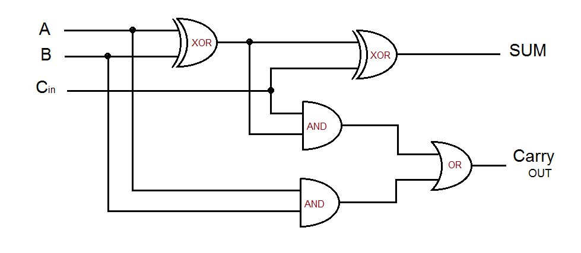
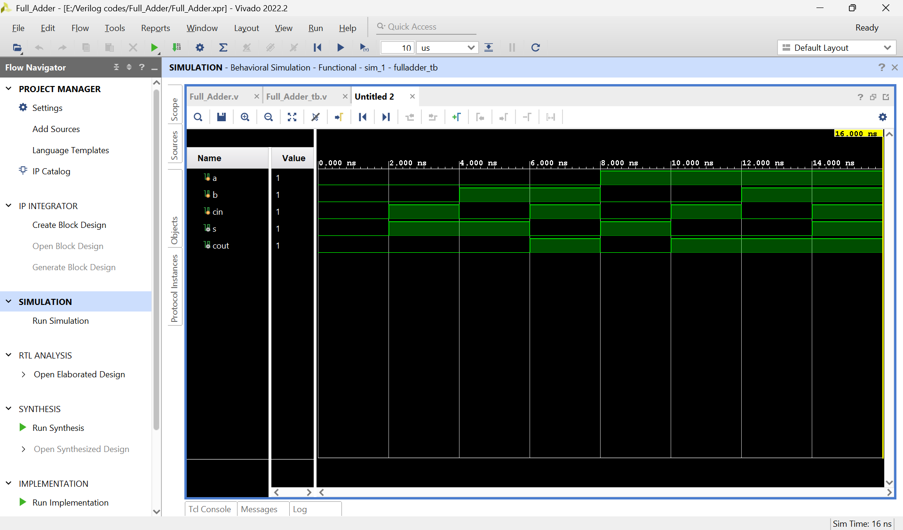

# ➕ Full Adder

## 📘 Definition
A **Full Adder** is a combinational circuit that performs the addition of three binary inputs:  
- Two significant bits (**A**, **B**)  
- One carry input (**C_in**)  

It produces two outputs:  
- **SUM**  
- **Carry_out**

---

## ⚙️ Working Principle
- Inputs: A, B, C_in  
- Outputs: SUM, Carry_out  
- Logic:  
  - SUM = A ⊕ B ⊕ C_in  
  - Carry_out = (A · B) + (C_in · (A ⊕ B))  

---

## 📊 Truth Table

| A | B | C_in | SUM | Carry_out |
|---|---|-------|-----|-----------|
| 0 | 0 | 0     | 0   | 0         |
| 0 | 0 | 1     | 1   | 0         |
| 0 | 1 | 0     | 1   | 0         |
| 0 | 1 | 1     | 0   | 1         |
| 1 | 0 | 0     | 1   | 0         |
| 1 | 0 | 1     | 0   | 1         |
| 1 | 1 | 0     | 0   | 1         |
| 1 | 1 | 1     | 1   | 1         |

---

## 📈 Simulation Waveform

  

The waveform shows how **SUM** and **Carry_out** change for all input combinations.

---

## ✅ Key Points
- Extends the Half Adder by including carry input.  
- Basis for constructing Ripple Carry Adders and larger arithmetic circuits.  
- Implemented using XOR, AND, and OR gates.  

---

## 📌 Applications
- Arithmetic operations in ALUs.  
- Binary addition in processors.  
- Building blocks for complex adders (RCA, CLA, CSA).  

---

## ⭐ Support
If you found this content helpful, consider giving the repository a **star** 🌟.  
