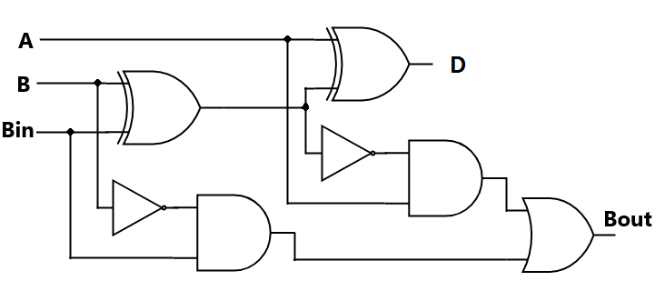
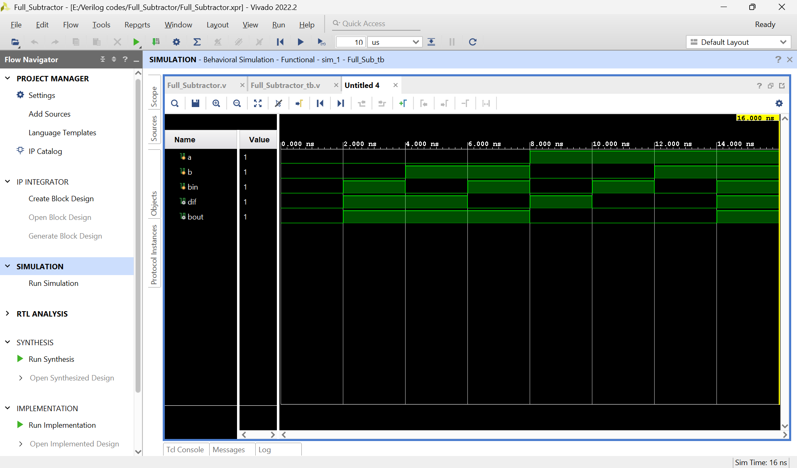

# ➖ Full Subtractor

## 📘 Definition
A **Full Subtractor** is a combinational circuit that subtracts three binary inputs:  
- Two significant bits (**A**, **B**)  
- One borrow input (**B_in**)  

It produces two outputs:  
- **Difference (D)**  
- **Borrow_out (B_out)**  

---

## ⚙️ Working Principle
- Inputs: A, B, B_in  
- Outputs: Difference, Borrow_out  
- Logic:  
  - Difference = A ⊕ B ⊕ B_in  
  - Borrow_out = (A' · B) + (B_in · (A' ⊕ B))  

---

## 📊 Truth Table

| A | B | B_in | Difference | Borrow_out |
|---|---|------|------------|------------|
| 0 | 0 | 0    |     0      |     0      |
| 0 | 0 | 1    |     1      |     1      |
| 0 | 1 | 0    |     1      |     1      |
| 0 | 1 | 1    |     0      |     1      |
| 1 | 0 | 0    |     1      |     0      |
| 1 | 0 | 1    |     0      |     1      |
| 1 | 1 | 0    |     0      |     0      |
| 1 | 1 | 1    |     1      |     1      |

---

## 📈 Simulation Waveform

  

The waveform shows how **Difference** and **Borrow_out** change for all input combinations.

---

## ✅ Key Points
- Extends the Half Subtractor by including borrow input.  
- Basis for constructing larger subtractor circuits.  
- Implemented using XOR, AND, OR, and NOT gates.  

---

## 📌 Applications
- Binary subtraction in ALUs.  
- Arithmetic operations in processors.  
- Building blocks for complex subtractors.  

---

## ⭐ Support
If you found this content helpful, consider giving the repository a **star** 🌟.  
Your support motivates me to keep improving and adding more projects!
