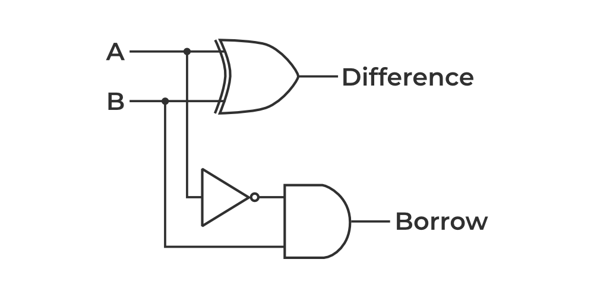
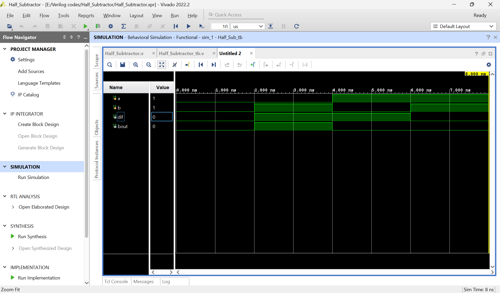

# ➖ Half Subtractor

## 📘 Definition
A **Half Subtractor** is a combinational circuit that subtracts two binary digits (**A − B**).  
It produces two outputs:  
- **Difference (D)**  
- **Borrow (B_out)**  

---

## ⚙️ Working Principle
- Inputs: A, B  
- Outputs: Difference, Borrow  
- Logic:  
  - Difference = A ⊕ B  
  - Borrow = A' · B  

---

## 📊 Truth Table

| A | B | Difference | Borrow |
|---|---|------------|--------|
| 0 | 0 |     0      |   0    |
| 0 | 1 |     1      |   1    |
| 1 | 0 |     1      |   0    |
| 1 | 1 |     0      |   0    |

---

## 📈 Simulation Waveform

  

The waveform shows how **Difference** and **Borrow** change for all input combinations.

---

## ✅ Key Points
- Performs subtraction of two bits.  
- Cannot handle borrow input (hence "half").  
- Basis for building Full Subtractors.  

---

## 📌 Applications
- Binary subtraction in processors.  
- Used in arithmetic logic units (ALUs).  
- Building blocks for larger subtractor circuits.  

---

## ⭐ Support
If you found this content helpful, consider giving the repository a **star** 🌟.  
